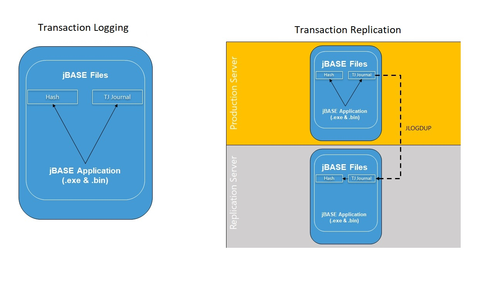

# INTRODUCTION TO TRANSACTION JOURNALING

**Created At:** 3/21/2018 7:20:44 AM  
**Updated At:** 3/21/2019 10:49:41 PM  

**Tags:**
<badge text='journaling' vertical='middle' />
<badge text='tj' vertical='middle' />
<badge text='transaction replication' vertical='middle' />
<badge text='transaction journalingt' vertical='middle' />
<badge text='replication' vertical='middle' />

## DOCUMENT SCOPE

The Introduction to Transaction Journaling document serves as a starting point for Administrators that are new to jBASE and would like to setup Transaction Journaling for the high availability of a stand along system or disaster recovery partner of the production jBASE system.

## PREREQUISITES

To perform this steps in this walkthrough document, you will need an installed and licensed system running jBASE 5.6 or greater, along with licensing for Transaction Journaling.  If you need to complete this task, please review jBASE Installation Guide for [Windows](windows-installation) or[Linux](jbase-56-linux-installation-guide).

You should also have reviewed Introduction to jBASE, for knowledge of commands and utilities used in this walk-through.

## OVERVIEW

The "Transaction Journaling" product includes both transaction logging and transaction replication.  Transaction logging (sometimes also called transaction journing) is the normal logging of database updates to a transaction log file.  These log files are typically used to restore changes made between backups.

Transaction Replication is a secondary process that takes transaction logs and commits them immediately to a second machine.   For purposes of this documentation transaction logging will be used to discuss transaction logging/journaling while transaction replication will be used to describe  updating a second machine (remote).

[Configuring Transaction Logging](configuring-transaction-logging)

[Monitoring Transaction Logging](305765-monitoring-transaction-logging)

[Restoring from a Transaction Log](restoring-from-a-transaction-log)

[Configuring Transaction Replication](configuring-transaction-replication)

[Monitoring Transaction Replication](monitoring-transaction-replication)

