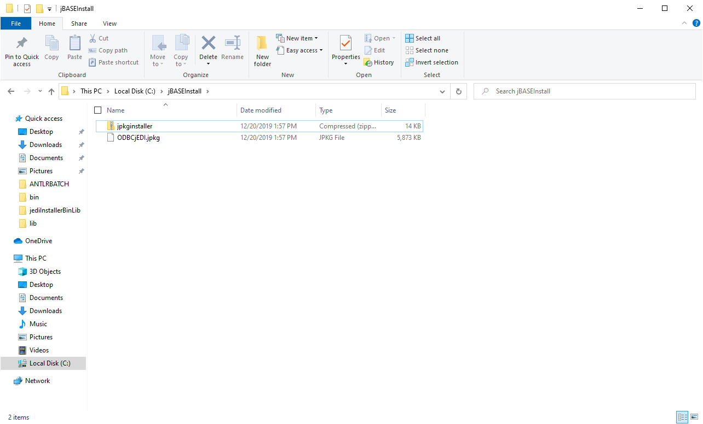
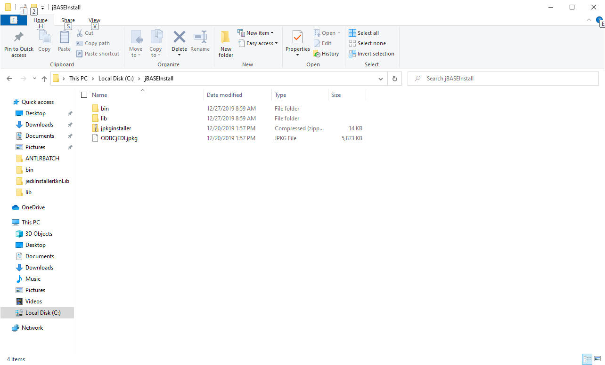
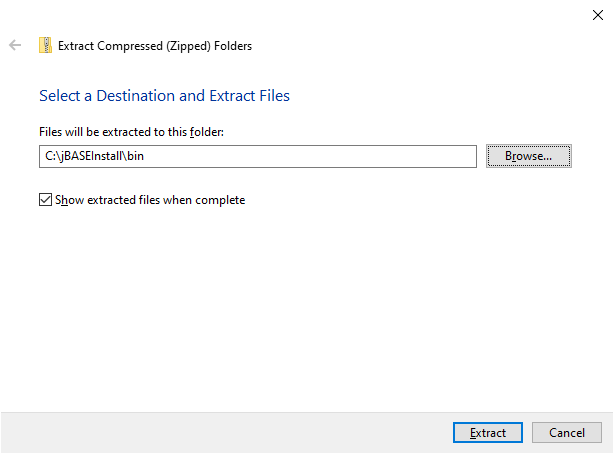

# Installing the ODBC jEDI on Windows

**Created At:** 12/27/2019 4:34:31 PM  
**Updated At:** 1/17/2020 12:46:42 AM  
**Original Doc:** [installing-the-odbc-jedi-on-windows](https://docs.jbase.com/installing-the-odbc-jedi-on-windows)  
**Original ID:** 509689  
**Internal:** Yes  


As previously stated, in order to properly perform the steps defined in this section, you will need a licensed system running jBASE 5.6 or greater, and the *ODBC* *jEDI*tool-set installation package. If you do not yet have a valid licensed jBASE system, and/or the *ODBC* *jEDI*tool-set installation package, please contact Zumasys licensing to obtain them.

The installation package is comprised of two components, the **ODBCjEDI.jpkg** and the **jpkginstaller.zip**; both can be removed from the target file system after successful installation. After receiving the *ODBC* *jEDI*tool-set installation package, do the following to ensure successful installation:

1. Save the installation package's components to a desired location on your file-system

### Note

For this example, **C:\jBASEInstall****\**will be the location our components are stored after initial download

2. Navigate to where your ODBC *jEDI*tool-set components are located on your file system



3. Create **bin\**and **lib\** sub-directories in this location



4. Unzip the **jpkginstaller.zip**component into the **bin\**sub-directory



### Note

You can remove the **jpkginstaller.zip** file once you have unzipped it into your bin\ sub-directory

5. Open up a command prompt where your *ODBC* *jEDI*tool-set components are located on your file system

```
C:\jBASEInstall>
```

6. Add the **bin\**sub-directory to your %PATH% environment variable

```
C:\jBASEInstall> set PATH=%PATH%;C:\InstallDir\bin
```

7. Run the **jpkginstall**command from the same directory your **ODBCjEDI.jpkg**file is located

```
C:\jBASEInstall> jpkginstall
```

8. If you do not yet have the **config\**or **CSV\** directories created within your %**JBCDATADIR%**directory, you will be prompted and asked if you'd like to create them. Enter Yes to have the installer create the directories for you. If you already have these directories set up, the installer will skip to step 9.

```
Unpacking...

Installation cannot complete: %JBCDATADIR%\config cannot be opened

Do you want to create it now? Yes

The default location for storing csv definitions (%JBCDATADIR%\CSV) cannot be opened

Would you like to create it now? Yes
```

9. You will be prompted and asked if you'd like to view the installer release notes. Enter No to continue with the installation.

```
Unpacking...    ODBC jEDI Installation

View release notes? No
```

10. You will be prompted with the following *DSN* fields to fill out. The installer will use the data entered into these fields to attempt to connect to a valid data source.

```
CSV directory:
Table Separator:
VMC Separator:
Passwords Encrypted:
UID:
Database:
Password:
```

### Field Descriptions

*DSN* - Data Source Name

CSV directory - Directory where csv definitions will be held for generating stubs

Table Separator - Character used to join the primary table and the multi/sub-value table (where applicable)

VMC Separator - Character used to join the VMC column with the multi/sub-value group name (where applicable)

Passwords Encrypted - Controls whether or not the user password will be encrypted in the jEDIdrivers.ini file

UID - User ID for the *DSN* specified

Database - Database name for the *DSN* specified

Password - Password for the *DSN* specified

Below is an example of filled out *DSN*fields:

```
DSN:                    SQLServerDSN    SQL Server Native Client 11.0
CSV directory:          C:\jBASE\CSV  
Table Separator:        _
VMC Separator:          _  
Passwords Encrypted:    Yes
UID:                    sa
Database:               master 
Password:               ********** 
```

10.  You will be prompted one last time and asked if you want to continue with your installation. Enter Yes to test your *DSN* connection. If the connection is successful, you will be told the installation has succeeded. If not, you will need to verify your *DSN* and the *DSN* fields in step 8 were set up correctly.

```
Continue with installation? Yes

Verifying installation... Success.
```

----------------------------------------------------------------------------------------------------------------------------

[Introduction to the ODBC jEDI](./../introduction-to-the-odbc-jedi)

[Installing the ODBC jEDI on Linux/Unix](./../installing-the-odbc-jedi-on-linux&unix)

[Structure of ODBC jEDI Initialization Files](./../structure-of-odbc-jedi-initialization-files)

[Structure of ODBC jEDI Mapping Files](./../structure-of-odbc-jedi-mapping-files)

[Configuring the ODBC jEDI on Linux/Unix](./../configuring-the-odbc-jedi-on-linux&unix)

[Configuring the ODBC jEDI on Windows](./../configuring-the-odbc-jedi-on-windows)

[Using the ODBC jEDI](./../using-the-odbc-jedi)
