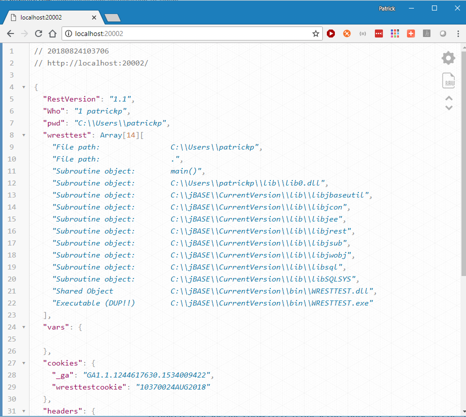

# jAgent RESTful Services Quick Start

**Created At:** 8/29/2018 1:44:36 AM  
**Updated At:** 10/22/2019 3:42:32 PM  
**Original Doc:** [336524-jagent-quick-start](https://docs.jbase.com/30312-jagent/336524-jagent-quick-start)  


# Introduction

Just like any other jBASE function, you must have a jBASE configured environment before you start jAgent.  The fastest way to get started is to launch jAgent from an already configured jsh environment.

Windows

```
C:\Users\demouser>JB
Account name or path: JBASEADM
jsh JBASEADM ~ -->CMD
Microsoft Windows [Version 10.0.17134.228]
(c) 2018 Microsoft Corporation. All rights reserved.

C:\jBASE\JBASEADM>JBASE_AGENT --config=
(12980|11044) NOTICE starting up jAgent, Process Per Connection mode, listening on port 20002, c:\petes\src\international\5.7.0\jagent\SocketAcceptor.h +63
```

Or Linux

```
-bash-4.2$ jb
Account name or path: JBASEADM
jsh JBASEADM ~ -->bash
bash-4.2$ jbase_agent --config=
(4157|140601231317120) NOTICE starting up jAgent, Process Per Connection mode, listening on port 20002, SocketAcceptor.h +63
```

Now open up a browser and point at your server port 20002.  Below is an example where jBASE is running on windows.  From the same computer, jBASE is running on you can browse directly.  If it is on another box you must put in the IP address of the jBASE server where you see localhost



On Linux, you can use curl (which you can also install on windows) and test the server from the command prompt

```
C:\Users\patrickp>curl http://localhost:20002
{"RestVersion":"1.1", "Who":"1 patrickp", "pwd":"C:\\Users\\patrickp", "wresttest": [ "File path:                C:\\Users\\patrickp","File path:                .","Subroutine object:        main()","Subroutine object:        C:\\Users\\patrickp\\lib\\lib0.dll","Subroutine object:        C:\\jBASE\\CurrentVersion\\lib\\libjbaseutil","Subroutine object:        C:\\jBASE\\CurrentVersion\\lib\\libjcon","Subroutine object:        C:\\jBASE\\CurrentVersion\\lib\\libjee","Subroutine object:        C:\\jBASE\\CurrentVersion\\lib\\libjrest","Subroutine object:        C:\\jBASE\\CurrentVersion\\lib\\libjsub","Subroutine object:        C:\\jBASE\\CurrentVersion\\lib\\libjwobj","Subroutine object:        C:\\jBASE\\CurrentVersion\\lib\\libsql","Subroutine object:        C:\\jBASE\\CurrentVersion\\lib\\libSQLSYS","Shared Object             C:\\jBASE\\CurrentVersion\\bin\\WRESTTEST.dll","Executable (DUP!!)        C:\\jBASE\\CurrentVersion\\bin\\WRESTTEST.exe"], "vars": {}, "cookies": {}, "headers": {"REMOTE_ADDR":"127.0.0.1", "REMOTE_HOST":"127.0.0.1", "PROTOCOL_VERSION":"HTTP\/1.1", "REQUEST_METHOD":"GET", "PATH_INFO":"\/api\/wresttest", "SERVER_PORT":"20002", "HTTP_ACCEPT":"*\/*", "HTTP_USER_AGENT":"curl\/7.55.1", "HTTP_HOST":"localhost:20002"}, "body":"", "status":"ok", "statusmsg":""}
C:\Users\patrickp>
```

In the above example jagent was fully configured to operate in the Account we shelled out of because the environment was already setup. Since we did not define an actual config file the default config file from your jBASE installation directory was used.  The default config file has all services enabled and is configured to listen on port 20002.  Since this is the first time running the RESTFul services (webserver) it requested as we did above will check the local account and see if a WDB.RESOURCE file exists, and if it does not exist it creates a new one and enables the WRESTTEST service.  The default config file is configured to default to /API/wresttest if no resource is requested.

If you are getting the above page then jAgent is up and running.  The WRESTTEST program is very helpful in reviewing your environment allowing to you make sure it is set up correctly.  You can now proceed to use the other jAgent features such as C#, java or ODBC.

It is recommended during development to use jAgent in this manner.  You can LOGTO any account where you are running your existing application and guarantee your environment is setup.  It is recommended you copy jagent\_config over to your account and call it directly vs using the template copy in the configuration directory.

```
c:\jbase\jbaseadmin> COPY C:\JBASE\CURRENTVERSION\CONFIG\JAGENT_CONFIG .
c:\jbase\jbaseadmin>jbase_agent --config=.\jagent_config  
or linux
# cp /opt/jbase/CurrentVersion/config/jagent_config ./
# jbase_agent --config=./jagent_config
```

You can now edit your config file and make changes.  You can run as many copies of jagent as you wish.  Each must run on its port.

```
; Specify the port that jagent will listen on for incoming connections.
; The default port is 20002. This option duplicates the -p (--port)
; command line option.
port = 20002
```

You can also run jAgent as a service.  You should

1. Create a new script to start/test your config.  In the default jBASE install directory, there is a good template called jbase\_env.cmd or jbase\_env.sh based on your platform.  Copy this script over to your account.
2. Make a copy of the jagent\_config into your directory.
3. Modify jagent\_config to listen on the port you want.
4. In the [ENVIRONMENT] section of jagent\_config set up your environment the way, you want it.
5. Modify your script to launch jbase\_agent pointing to your new jagent\_config.
6. Test your services again using WRESTTEST.
7. If everything is working you can then install jAgent as a service as described later in this document.
8. It is always best to be able to run any jAgent instance locally to diagnose why it isn't working.  Only after you have it working should you move to have it as a service.


