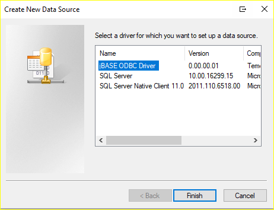
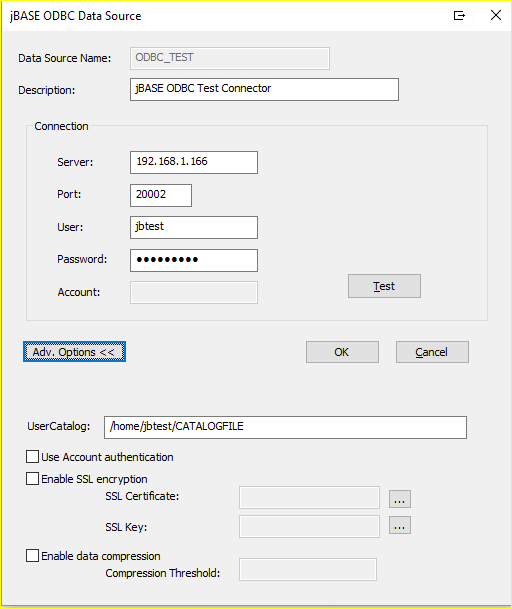
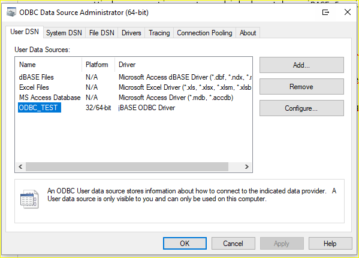
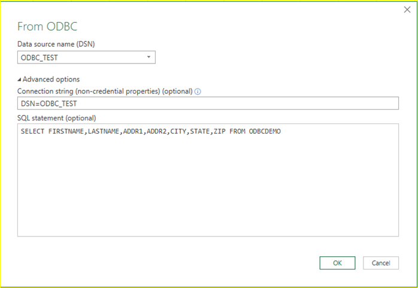
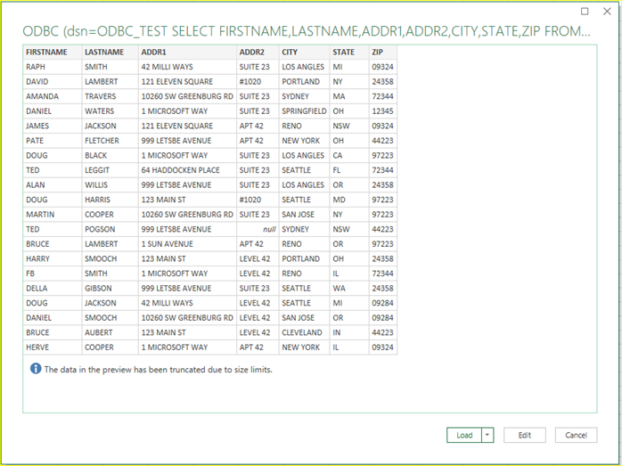
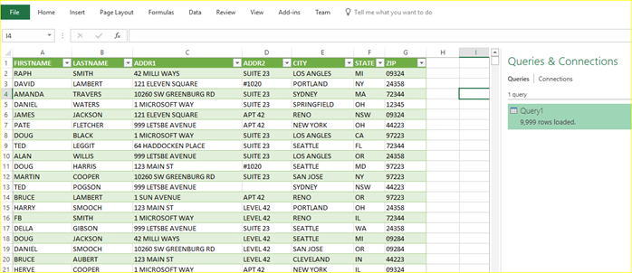
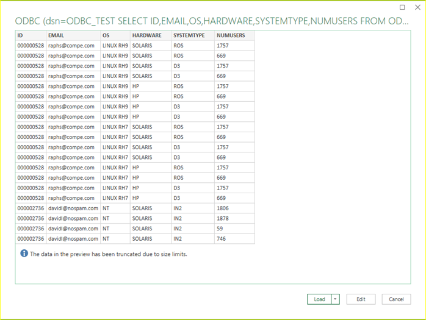

# ODBC Quick Start

**Created At:** 12/15/2017 5:50:10 PM  
**Updated At:** 4/22/2019 5:30:52 PM  
**Original Doc:** [291428-odbc-quick-start](https://docs.jbase.com/30312-jagent/291428-odbc-quick-start)  

**Tags:**
<badge text='sql' vertical='middle' />
<badge text='odbc' vertical='middle' />

The ODBC Connector is included with jBASE 5.x but may also be deployed on any Windows operating systems which do not have jBASE 5.x installed.  A self-contained installer (from now on referred to as jODBC installer) is available which installs and registers the ODBC driver.   ([Client Software Download](https://zumasys.us8.list-manage.com/track/click?u=ed1011024b445ab7d2f0c1e6e&id=7aaa8beaa2&e=57befd976d))

On Linux, to set up an ODBC Data Source definition, a jbase\_agent listener must already be running on the jBASE Linux server.  There is an example script to start/stop jbase\_agent on Linux at the end of this document.

Via “Control Panel -&gt; Administrative Tools -&gt; ODBC Data Sources (64-bit)”, define a new Data Source:








To be able to run the Data Source “Test”, the jbase\_agent listener must already be running.

You can specify which files are visible to jODBC by means of an SQL Catalog file. This file will contain an entry for each file that needs to be accessible to jODBC.

The location of the SQL Catalog file is set via the JSQLFILENAME\_CATALOG environment variable, and may be set on a per DSN basis using the UserCatalog option in the jBASE ODBC Data Source, as above.

The Catalog file is just a regular jBASE hashed file and new entries can be added via “jED” or “ED”, i.e.:

```
ODBCDEMO
001 /home/jbtest/ODBCDEMO
002 /home/jbtest/ODBCDEMO]D
```


For the purposes of this document, we have used the “make-demo-file” utility to create a new test file for querying:

```
DICT PATH : DICT ODBCDEMO                                                                          Page   1 13:08:11  15 DEC 2017
*A0...........    D/CODE...    A/AMC....    S/NAME....    V/CONV...    V/CORR...    V/TYPE...    V/MAX
FIRSTNAME         A            1            First Name                              L               24
EMAIL             A            10           Email                                   L               22
HARDWARE          A            11           Hardware                                L               15
OS                A            12           OS                                      L               15
SYSTEMTYPE        A            13           MVDBASE                                 L               24
NUMUSERS          A            14           Num Users                               L                6
LASTNAME          A            2            Last Name                               L               20
ADDR1             A            3            Address                                 L                6
                                            Line 1
ADDR2             A            4            Address                                 L               20
                                            Line 2
CITY              A            5            City                                    L               10
STATE             A            6            State                                   L                3
ZIP               A            7            Zip                                     L               12
HOMETEL           A            8            Home Tel                                L               16
WORKTEL           A            9            Work Tel                                L               16
 14 Records Listed
```


It is possible to use Account authentication for these ODBC connections, but, to keep things simple we will start off by not using any authentication.

This means that the jbase\_agent listener should be started in the account folder where the files to be queried reside.



The Data Source can now be referenced by an ODBC aware Windows application, i.e. Excel.

Open a new Excel spreadsheet and navigate to the Data tab, then:

Data -&gt; Get Data -&gt; From Other Sources -&gt; From ODBC





Press the “Load” button and the spreadsheet will be populated:





> Note: On initial “Load”, even without authentication in place, Excel may request a User ID and Password, which would be the user credentials of the account where the jbase\_agent listener is running.


Multi-valued data is returned in first-normal form, which means that any “singular” fields will be repeated for each multi-valued occurrence.

Having added an “ID” dictionary definition to the ODBCDEMO file, the following is an example of a multi-value query:




Below is a sample script to start jbase\_agent.

### Info

Please note that it is now also possible to start jbase\_agent as a service, and also via a jbase\_agent config file, see this [link](/30312-jagent/336525-jagent-administration).

```
#/bin/ksh
export HOME=/home/jbtest
stty intr ^C kill ^? icanon opost echo echoe echok onlcr -lcase tab3 erase ^H
#
# undefine common stty settings to avoid clash with some terminfo and jed controls
if [ `uname` != "Linux" ]
then
    stty quit ^- dsusp ^- susp ^-
else
    stty quit ^- susp ^-
fi
alias X="stty $(stty -g)"
umask 000
PS1="$(uname)-\$PWD: "
ENV=${HOME}/.env
VISUAL=/usr/bin/vi
set -o vi
cd
JBCRELEASEDIR=/opt/jbase5/5.6
JBCGLOBALDIR=$JBCRELEASEDIR
export JBCRELEASEDIR JBCGLOBALDIR
JBCOBJECTLIST=${HOME}/lib
export JBCOBJECTLIST
export LIBPATH=$JBCRELEASEDIR/lib:$NAVROOT/lib:$LIBPATH:/usr/lib
export LD_LIBRARY_PATH=$LIBPATH
JEDIFILEPATH=$HOME
export JEDIFILEPATH
JBCSPOOLERDIR=/opt/jbase5/jbase_data/jspooler
export JBCSPOOLERDIR
JEDIFILENAME_MD=$HOME/MD]D
JEDIFILENAME_SYSTEM=/home/jbase/SYSTEM
export JEDIFILENAME_MD JEDIFILENAME_SYSTEM
PATH=$JBCRELEASEDIR/bin:/usr/local/bin:$PATH:.
PATH=$HOME/bin:$PATH
export PATH
PAGER=more
export PAGER
LANG=en_US
JBASE_LOCALE=en_US
JEDIENABLEQ2Q=1
export LANG JBASE_LOCALE JEDIENABLEQ2Q
JBASE_ERRMSG_ZERO_USED=33
export JBASE_ERRMSG_ZERO_USED
export JBASEI18N=1
export JBASE_CODEPAGE=cp437
export JBASE_DYNAMIC_MULTISESSION=1
export JBCEMULATE=jbase
JBCLOGNAME=jremote
export JBCLOGNAME
case "$1" in
'start')
    jbase_agent start -Anone -F -L 2
    ;;
'stop')
    jbase_agent stop
    ;;
*)
    echo "jremote start|stop"
    ;;
esac
```


> Note: For the purposes of this test, the script was called “jremote”.
> 
> Usage:
> 
> ./jremote start
> 
> ./jremote stop
> 
> The call to jbase\_agent includes the creation of a log file. If logging (for debug purposes) is not required, the “-F -L 2” options can be omitted.

