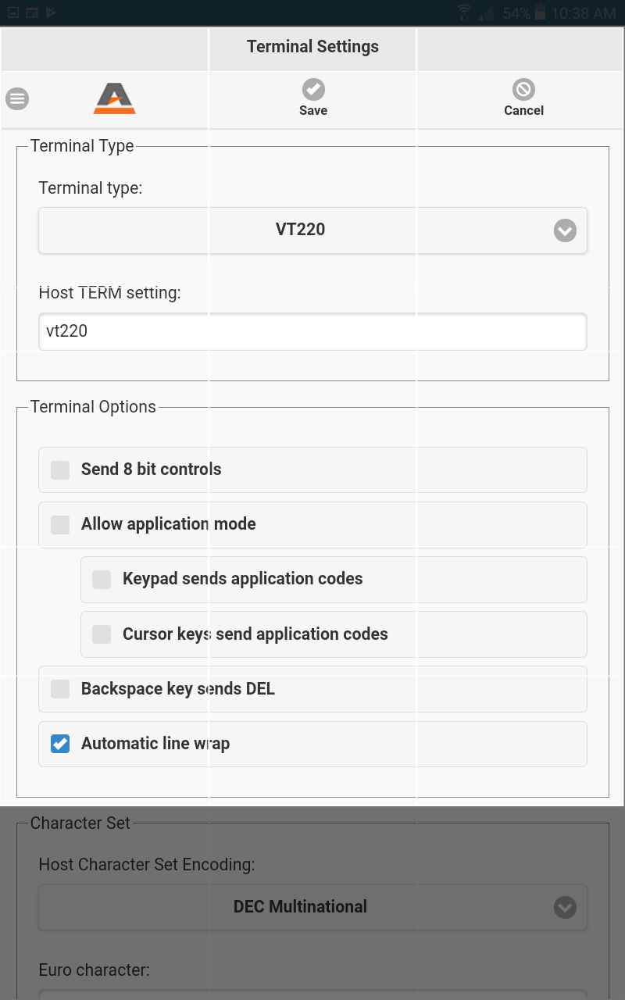
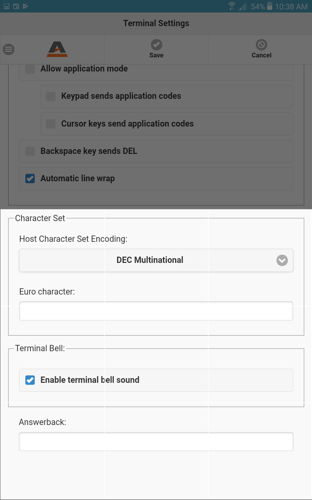

# AccuTerm Mobile: Terminal Settings

**Created At:** 11/15/2019 6:38:17 PM  
**Updated At:** 11/15/2019 7:32:18 PM  
**Original Doc:** [accuterm-mobile-terminal-settings](https://docs.zumasys.com/accutermmobile/accuterm-mobile-terminal-settings)  
**Original ID:** 494601  
**Internal:** No  

## Terminal Type

| Terminal Emulation: | In order for AccuTerm to work properly with terminal-based applications, the terminal type that AccuTerm is emulating must match the terminal type the host application is configured or designed to use. Select the terminal type (emulation or personality) from the drop-down list. If you select the wrong type, your screen will probably be scrambled, and you should try a different type. The following supported terminal types for AccuTerm 8 Web are :<ul><li>TTY</li><li>Wyse 50</li><li>Wyse 60</li><li>ADDS Viewpoint</li><li>Viewpoint Enhanced</li><li>VT100</li><li>VT220</li><li>VT320</li><li>VT420</li><li>Linux Console</li><li>Xterm</li><li>Pick PC Monitor</li></ul> |
| --- | --- |
| Host Terminal Type: | In order for AccuTerm to work properly with terminal-based applications, the terminal type that AccuTerm is emulating must match the terminal type the host application is configured or designed to use. Select the terminal type (emulation or personality) from the drop-down list. If you select the wrong type, your screen will probably be scrambled, and you should try a different type. |

## Terminal Options

| Send 8-bit controls: | Send 8 bit controls If this option is selected, then 8-bit control codes will be transmitted to the host. If the option is not set (the default), equivalent 7-bit escape sequences will be transmitted to the host. This option applies to the VT220, VT320, VT420, and Linux Console emulations. |
| Allow application mode: | When this option is selected (the default), commands that switch the numeric keypad keys and cursor keys into "application mode" are emulated. When the option is not selected, those commands are ignored, preventing the terminal from switching to "application mode". This option is useful when the host or application erroneously sends the command to enter application mode, and the application is expecting normal numeric or cursor keys. This option applies to the VT emulations (except VT52) and Linux Console emulation. |
| Keypad sends application codes: | When this option is selected, the numeric keypad keys send special application codes. When the option is not set (the default), the numeric keypad keys send decimal numbers. This option applies to the VT emulations (except VT52) and Linux Console emulation. |
| Cursor keys send application codes: | When this option is selected, the cursor keys send special application codes. When the option is not set (the default), the cursor keys send normal cursor codes. This option applies to the VT emulations (except VT52) and Linux Console emulation. |
| Backspace key sends DEL: | When this option is selected, the BACKSPACE key sends the DEL (delete) control code. When the option is not set (the default), the BACKSPACE key sends the BS (backspace) control code. This option applies to the VT emulations (except VT52) and Linux Console emulation. |

## Character Set

| Euro character  | If your host application needs to display the Euro currency symbol, enter the ASCII value of the Euro symbol, as used on your system. Note: for most character sets there is no standard value for this symbol. Some possible values are 128 (Windows ANSI), 164 (Latin-1 currency and Latin-9 Euro) and 213 (IBM modified code page 850). Unicode (UTF-8) defines the Euro as U+20AC. If you are using Unicode encoding, the Euro character value is ignored.  |
| Host Character Encoding | DEC Multinational, Latin-1, IBM-PC and UTF-8  |
| Terminal Bell | Like the margin bell of antique mechanical typewriters, terminals have the ability to "ring a bell", usually to get the attention of the operator. The ASCII BEL control code is universally used to "beep" the terminal. AccuTerm provides great versatility in customizing the sound generated by this command.  |

