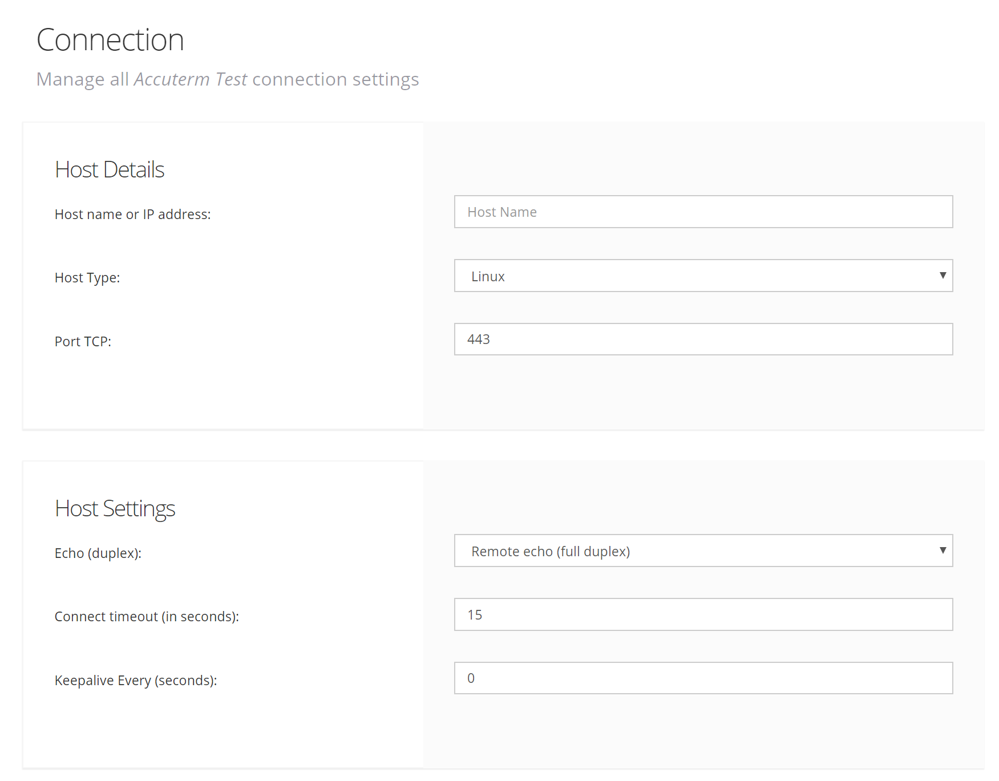

# AccuTerm 8: Connection Settings

**Created At:** 8/12/2019 9:37:09 PM  
**Updated At:** 11/15/2019 6:18:18 PM  
**Original Doc:** [accuterm-8-connection-tab](https://docs.zumasys.com/accuterm/accuterm-8-connection-tab)  

## Connection

AccuTerm supports Telnet connections to host machines over a TCP/IP network. Any Telnet server (host) on the network, including hosts on the Internet, can be accessed.

### Host Details

| Hostname/IP Address | Enter the hostname or IP address in this field. If the desired hostname has been used previously when configuring a Telnet session, you may select it from the drop-down list by clicking the drop-down arrow in this field. |
| --- | --- |
| Host Type | If your host is listed in the Host Type list, select it, otherwise, just use the default host type. By selecting a host type from this list, certain advanced options are configured to be compatible with the specified host type. For some host types, the port number and host terminal type are also adjusted. |
| Port | If the Port field is left blank, or set to "Default" AccuTerm will use TCP port 23 (the default port for Telnet). If a different port is used for Telnet connections to your host, enter that port number in this field. Certain host systems, such as Raining Data D3, allow a host process number (PIB) to be mapped to a specific TCP port number. You can use the Port setting to specify the port number mapped to your process number. Consult with your system administrator for this setting.  |

### Host Settings

| Echo (duplex) | There are three echo options: remote echo (full-duplex), local echo (half-duplex) and a loopback (local mode). Typical terminal sessions operate in full-duplex. In this mode, all characters typed on the keyboard are sent to the host computer. They are not printed on the screen. The host echoes the character back to the terminal where it is displayed on the screen. Usually, when control characters ( ENTER, BACKSPACE, DELETE, etc.) or function keys are sent to the host, the echo is suppressed and the application responds in an appropriate manner. In half-duplex mode, characters typed on the keyboard are simultaneously sent to the host computer and displayed on the screen. In loopback mode, characters are displayed directly on the screen and are not sent to the host computer. This mode is usually used only for testing keyboard or display functions.  |
| Connection Timeout | When establishing a connection to a host computer, AccuTerm will wait up to the specified number of seconds before giving up. If this field is left blank, or zero, the default timeout is 15 seconds.  |
| Keepalive | Although the Telnet protocol specification does not provide for "keepalives", AccuTerm can send periodic commands that should be ignored by most Telnet servers. Using keepalives may prevent the host (or router) from detecting that the connection is idle and forcing a disconnect. To use keepalives, select either DMARK or NOP as the command to send as a keepalive. Enter the desired interval in the every... sec field.  |

